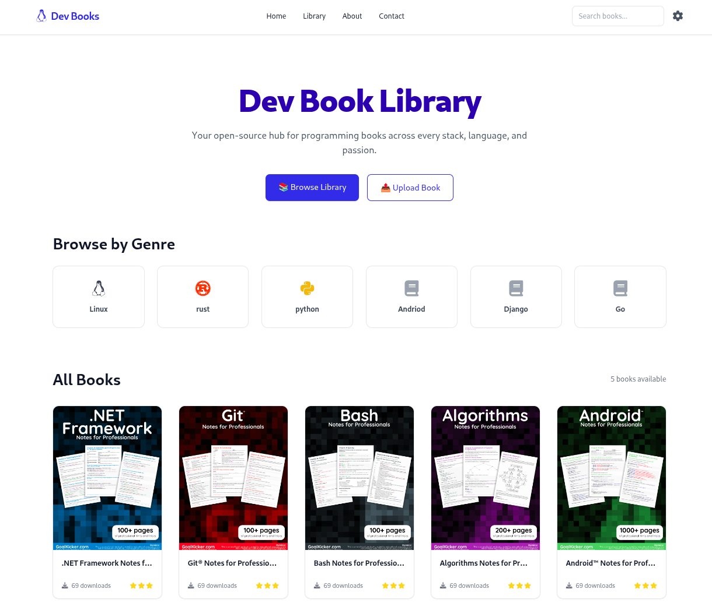
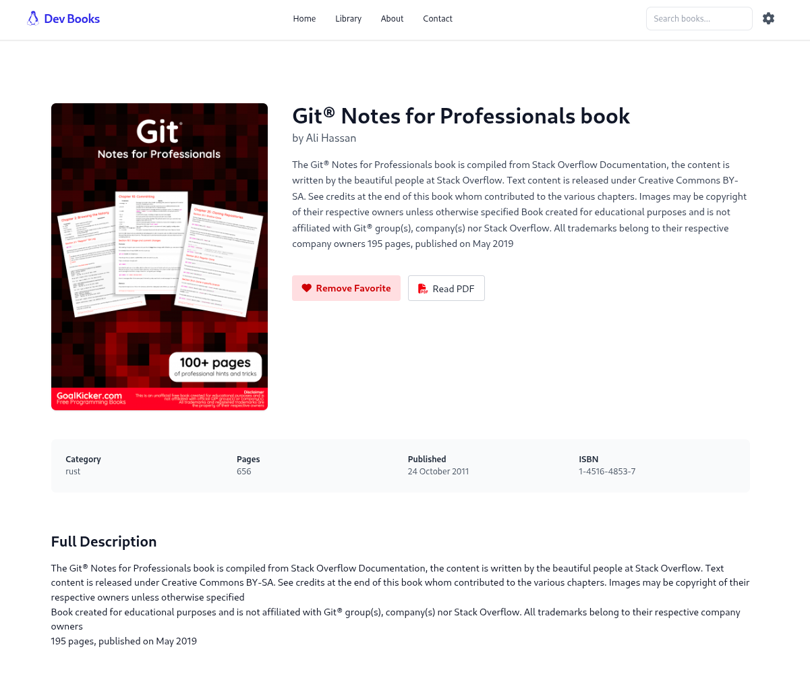
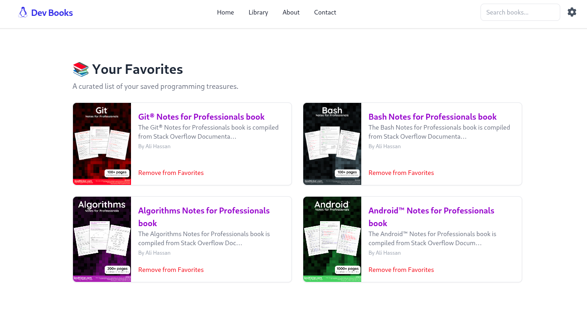
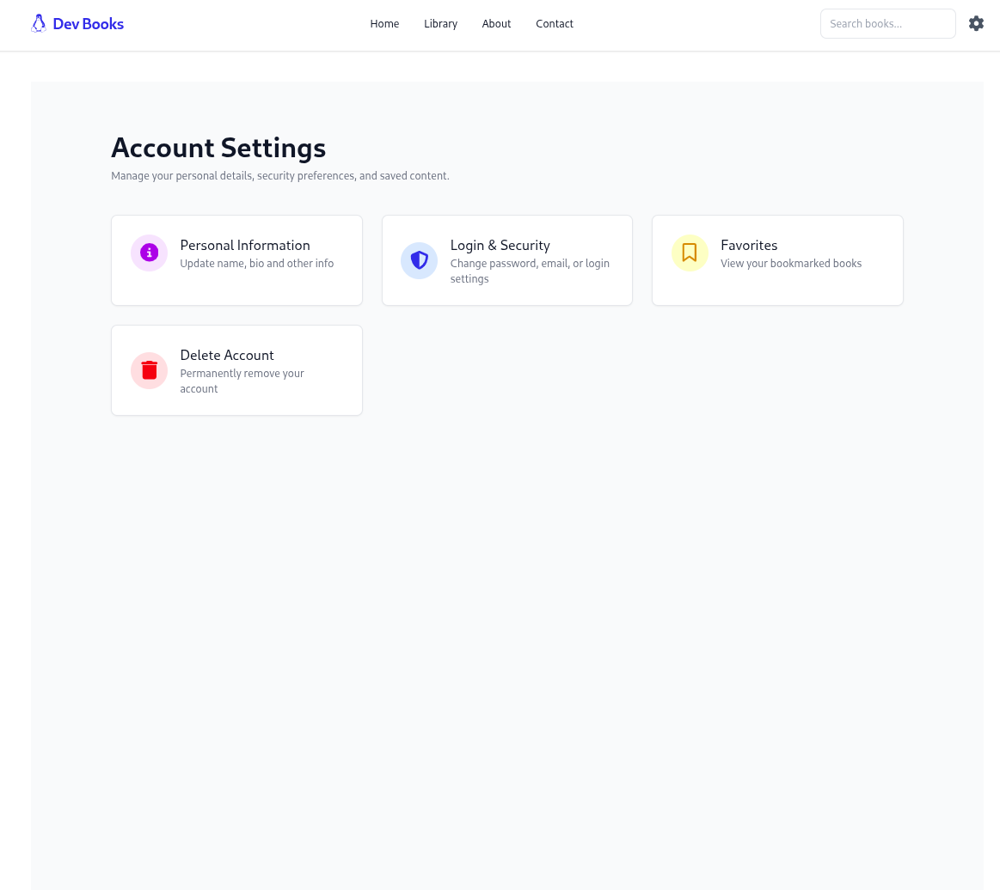

# Dev Books

A full-stack Django website for programmers to freely download and upload programming books — enabling community-driven resource sharing.

---

## Requirements

- Python **3.11.5**
- `pip` (comes with Python)
- [`uv`](https://github.com/charliermarsh/uv) (Python package manager)

---

## Setup Instructions

### 1. Ensure Python 3.11.5 is Installed

```bash
python3 --version
# Output should be: Python 3.11.5
````

Download if needed: [Python 3.11.5](https://www.python.org/downloads/release/python-3115/)

---

### 2. Install `uv`

```bash
pip install uv
```

---

### 3. Install Dependencies

```bash
uv sync
```

This automatically creates and uses `.venv` behind the scenes.

---

### 4. Set Environment Variables

Create a file at:

```bash
core/setting/.env
```

Add the following:

```env
SECRET_KEY=your-secret-key
DEBUG=True

EMAIL_HOST_USER=you@example.com
EMAIL_HOST_PASSWORD=your-password
```

---

## Run the Project

### Make Migrations for Apps

```bash
uv run manage.py makemigrations users library
```

### Apply Migrations

```bash
uv run manage.py migrate
```

### Create a Superuser

```bash
uv run manage.py createsuperuser
```

### Run the Development Server

```bash
uv run manage.py runserver
```

---

## Summary

| Task                 | Command                                         |
| -------------------- | ----------------------------------------------- |
| Install dependencies | `uv sync`                                       |
| Create migrations    | `uv run manage.py makemigrations users library` |
| Apply migrations     | `uv run manage.py migrate`                      |
| Create superuser     | `uv run manage.py createsuperuser`              |
| Run server           | `uv run manage.py runserver`                    |

---

## Notes

* `uv` handles virtual environments automatically. No need to manually activate anything.
* Make sure the Django project is configured to load environment variables from `core/setting/.env` using a package like [`django-environ`](https://github.com/joke2k/django-environ).

---

## Website Preview

> Below are some preview screenshots of the website.

## Home Page


## Book Detail Page


## Favorite Page


## Account Setting Page



